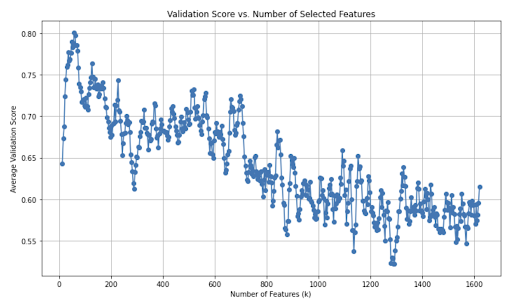
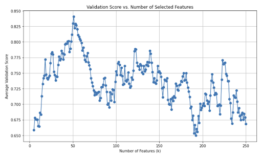
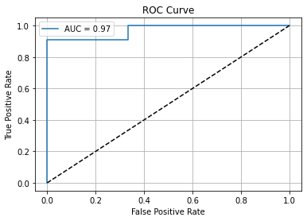

# Deep Feed-Forward Neural Network from Scratch (Pure NumPy)

*Developed as the final project for the Introduction to Machine Learning course (B.Sc. Computer Science).*

A vectorized, arbitrary-depth **Multi-Layer Perceptron (MLP)** engine implemented from scratch in pure **NumPy**, evaluated on two distinct machine learning paradigms:
1. **Large-Scale Multi-Class Vision (`MNIST`):** 10-class handwritten digit classification ($784$ input pixels).
2. **High-Dimensional Low-Sample Biomedical Tabular Data (`MB Dataset`):** Binary classification (Fibromyalgia vs. Control) under extreme $p \gg n$ constraints ($1,620$ features vs. $100$ samples).

---

## 1. Core Neural Network Architecture (`NeuralNetwork`)

Rather than relying on high-level deep learning frameworks (PyTorch/TensorFlow), the `NeuralNetwork` class implements all mathematical operations, matrix calculus, and optimization routines directly in NumPy:

* **Unified Bias Matrix Representation:** Integrates layer biases directly as an additional row in each weight matrix $W^{(l)} \in \mathbb{R}^{(n_{l-1}+1) \times n_l}$ by horizontally concatenating a column of `1`s to the activation matrix $X^{(l-1)}$, enabling single-operation left-to-right matrix multiplication ($S^{(l)} = X_{\text{bias}}^{(l-1)} W^{(l)}$).
* **He Weight Initialization:** Initializes weights using $W \sim \mathcal{N}(0, 1) \cdot \sqrt{2 / n_{\text{in}}}$ to prevent vanishing and exploding gradients across deep ReLU layers.
* **Numerically Stable Activations & Loss:**
  * **Hidden Layers:** Vectorized **ReLU** ($f(z) = \max(0, z)$) and its step derivative ($f'(z) = \mathbb{I}(z > 0)$).
  * **Output Layer:** Numerically stabilized **Softmax** via row-wise max subtraction ($\exp(z - \max(z))$) to prevent exponential overflow (`inf`/`NaN`).
  * **Objective Function:** Multi-class **Cross-Entropy (Log-Loss)** with probability clipping ($\epsilon = 10^{-15}$) combined with **L2 Weight Decay Regularization** (explicitly excluding the bias row from penalty calculations).
* **Mini-Batch SGD & Early Stopping:** Shuffles training permutations every epoch, updates weights via mini-batch gradient descent, monitors validation loss against a minimum improvement threshold (`thresh = 1e-5`, `patience = 5`), and automatically restores the optimal weight matrices (`best_weights`).

---

## 2. Benchmark 1: MNIST Digit Classification

### Experimental Progression & Optimization
Starting from a baseline 1-hidden-layer Sigmoid network that suffered from gradient overflow (46.0% accuracy), iterative architectural refinements yielded substantial gains:

| Iteration / Configuration | Architecture | Key Engineering Changes | Train Accuracy | Test Accuracy |
| :--- | :---: | :--- | :---: | :---: |
| **1. Baseline Sigmoid** | `[784, 128, 10]` | Full-batch, `lr=0.01`, 10 epochs (weight overflow) | 46.02% | 46.00% |
| **2. Mini-Batching** | `[784, 128, 10]` | Added `batch_size=100`, reduced `lr=0.001` | 86.72% | 87.14% |
| **3. ReLU + Deeper Net** | `[784, 256, 128, 10]` | Replaced Sigmoid with ReLU + He Initialization | 94.99% | 92.74% |
| **4. Early Stopping** | `[784, 512, 256, 10]` | Added validation split (20%), Early Stopping (`epochs=50`) | 97.42% | 94.11% |
| **5. L2 Regularization (Final)** | `[784, 512, 256, 10]` | Added L2 Weight Decay ($\lambda=0.01$), per-epoch batch shuffling, `epochs=100` | **99.99%** | **96.28%** |

---

## 3. Benchmark 2: High-Dimensional Biomedical Dataset (`MB`)

### The $p \gg n$ Overfitting Challenge
The `MB` dataset presents a classic bioinformatics challenge: classifying patients into **Fibromyalgia (`Fibro`)** vs. **Healthy Control (`Ctrl`)** across **1,620 continuous features** with only **100 total samples**.
* Training the raw 1,620-input network resulted in severe overfitting: **94.00% training accuracy** vs. **65.00% validation accuracy**.

### Stage 1: 5-Fold Stratified Cross-Validation Grid Search
To stabilize hyperparameter selection on such a small dataset, a 5-fold `StratifiedKFold` grid search was executed across **23 network topologies**, **3 learning rates** (`0.0001`, `0.001`, `0.01`), and **5 L2 regularization values** ($\lambda \in [0, 0.1]$), alongside `StandardScaler` feature normalization:
* **Optimal Architecture:** `[Input, 64, 32, 2]` with `lr = 0.01`, `batch_size = 10`, and strong L2 regularization ($\lambda = 0.1$).
* This raised average validation accuracy from **65.00% to 72.00%**, confirming that high feature dimensionality remained the primary bottleneck.

### Stage 2: Random Forest Feature Importance Pruning ($k = 41$)
Rather than applying unsupervised linear dimensionality reduction (PCA), a **Random Forest Classifier** (`n_estimators=100`) was used to rank all 1,620 features by Gini importance:
1. **Coarse Sweep ($k \in [1, 1620]$):** Evaluated 500 intervals across the full feature space, revealing that validation accuracy peaked below $k=100$ and degraded toward random chance (~58–60%) past $k=800$ due to noisy features.
2. **Fine-Grained Sweep ($k \in [1, 250]$, step = 1):** Pinpointed the exact global optimum at **$k = 41$ features** (pruning **97.5%** of noisy features).




### Final Biomedical Classification Results ($k = 41$)

| Metric | Baseline (1,620 Features) | Grid Search Only | Final Pipeline ($k=41$ + Tuned MLP) |
| :--- | :---: | :---: | :---: |
| **Training Accuracy** | 94.00% | 94.00% | **95.00%** |
| **Average Validation Accuracy** | 65.00% | 68.28% – 72.00% | **87.40%** |
| **Peak Validation Accuracy** | - | 75.00% | **90.00%** |
| **F1-Score (Validation)** | - | - | **0.8421** |
| **ROC-AUC Score** | - | - | **0.9697** |



---

## Getting Started

### Prerequisites
Install the required dependencies:
```bash
pip install numpy pandas scikit-learn matplotlib jupyter
```

### Running the Experiments
1. Extract `MNIST-train.zip` in the project root directory so that `MNIST-train.csv`, `MNIST-test.csv`, and `MB_data_train.csv` are in the same folder as the notebook.
2. Launch the Jupyter Notebook and execute the cells sequentially:
```bash
jupyter notebook Targil5.ipynb
```
